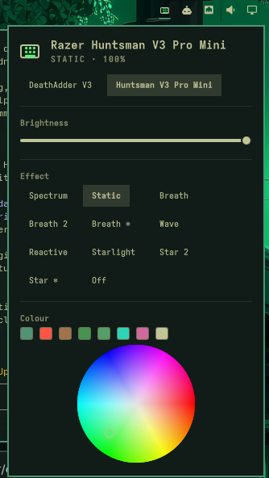

# Razer lighting for Omarchy

Control OpenRazer keyboard and mouse lighting from the Omarchy bar — brightness,
effects, and colour — without the polychromatic tray applet.

 



## Why

Polychromatic's tray applet works, but it rides in on
`libayatana-appindicator`, which exports a DBusMenu and a no-op `Activate`
method and never sets the `ItemIsMenu` property. Omarchy's tray reads that as
"this item has a click action", calls `activate()`, and nothing happens — so the
applet only responds to **right**-click. This plugin is a native bar widget
instead, so it behaves like every other Omarchy widget.

## Install

```bash
omarchy plugin add https://github.com/M8SON/omarchy-razer
bash ~/.config/omarchy/plugins/daedalus.razer/setup.sh   # first time only
omarchy plugin enable daedalus.razer right
```

`setup.sh` installs `openrazer-daemon`, adds you to the `openrazer` group, and
sets `restore_persistence = True`. Skip it only if OpenRazer already works.

## Uninstall

```bash
rm -f ~/.config/omarchy/hooks/theme-set.d/razer   # if you linked the hook
omarchy plugin disable daedalus.razer
omarchy plugin remove daedalus.razer
```

That takes the widget off the bar and deletes the plugin folder. `setup.sh`
changed three things *outside* the plugin, and none of them are reverted
automatically — undo them only if you want OpenRazer gone entirely:

```bash
systemctl --user disable --now openrazer-daemon
sudo gpasswd -d "$USER" openrazer      # log out and back in to take effect
sed -i 's/^restore_persistence.*/restore_persistence = False/' \
  ~/.config/openrazer/razer.conf
omarchy pkg drop openrazer-daemon python-openrazer
```

The last line also removes the DKMS kernel module. Leaving the daemon installed
is harmless if you use any other Razer tool.

## Use

- **Left-click** the bar icon to open the panel
- **Middle-click** to force a refresh
- Brightness slider and an effect grid offering every effect the device
  advertises — spectrum, static, breath (single, dual, random), wave, reactive,
  ripple (single, random), and starlight (single, dual, random)
- For the effects that take a colour, a full HSV **colour wheel**: hue around
  the circumference, saturation centre-to-edge, a value slider beneath, and a
  live hex readout. The dual effects take two colours; a **Colour 1 / Colour 2**
  row picks which one the wheel is editing, and both swatches stay visible
- A **theme palette** row above the wheel, filled from the Omarchy theme you
  are actually running — accent, red, orange, yellow, green, cyan, blue,
  magenta, foreground. Click one to put that colour on the keyboard. Switch
  theme and the row refills itself, so the lighting can follow the desktop
  without leaving the panel
- **Battery** percentage, and whether it is charging, for wireless devices
- `r` refreshes, `o` turns lighting off, `Esc` closes

A device appears if *anything* about it is controllable. RGB keyboards and mice
get the lighting controls; a mouse gets **Sensitivity** (DPI slider plus the
device's own stage presets) and **Polling rate** (only the rates the device
actually advertises). On mice that expose a fixed set of DPI steps rather than a
continuous range, the slider snaps to those steps. A wired DeathAdder V3 reports zero lighting capabilities
but full DPI and poll-rate ones, so it shows the performance controls alone.

When more than one device is controllable, a switcher row appears under the
title.

## Follow the theme automatically

The swatch row makes matching the Omarchy theme one click. To make it zero
clicks, link the bundled hook so the colour is reapplied whenever the theme
changes:

```bash
ln -sf ~/.config/omarchy/plugins/daedalus.razer/theme-hook.sh \
       ~/.config/omarchy/hooks/theme-set.d/razer
```

Delete that link to turn it off again. It needs no executable bit — Omarchy
runs everything in `theme-set.d` through `bash`.

The hook prefers the theme's own `keyboard.rgb`, which is the colour the theme
author picked for hardware and is not always the accent, and falls back to
`accent` from `colors.toml`. Omarchy has shipped `keyboard.rgb` and an
`omarchy-theme-set-keyboard` dispatcher for a while, but only for ASUS ROG and
F16 hardware — nothing consumed it for Razer, which is what this fills in.

It is deliberately quiet: no theme colour, no valid colour, or no Razer
lighting present all exit 0 without touching anything, because a hook that runs
on every theme change must never make the switch fail. A wired DeathAdder V3
reports no lighting at all and is simply skipped.

## Settings

| Key | Default | Meaning |
|-----|---------|---------|
| `refreshIntervalSec` | 30 | How often the open panel re-reads device state |

## Implementation notes

Everything goes through `openrazer-daemon` over D-Bus, via `razerctl.py`.

**The helper is held open, not spawned per command.** Importing `openrazer`
costs ~92 ms while the D-Bus write itself costs ~4 ms, so a process per command
capped the colour wheel at ~9 updates/sec and read as the colour lagging behind
the pointer. `razerctl.py serve` reads one JSON argv array per line on stdin and
replies with one JSON object per line; a colour sample then round-trips in ~3 ms.
The helper starts when the panel opens and exits 45 s after it closes, so its
~32 MB is not held while idle — the bar icon keeps rendering from the last read.
It is restarted automatically if it dies, up to three times per panel session.

`Process.running` is assigned imperatively and **never bound**. Quickshell writes
that property itself when the child exits, and an imperative write from C++
destroys a QML binding permanently — so `running: someFlag` works exactly once,
after which the helper can never be restarted and every command queues forever.

**The helper writes no files.** Effect and colour are both read live from the
daemon — `fx.effect` and `fx.colors`, the latter returning nine bytes for the
three colour slots. That is only trustworthy because a static apply sets the
named effect *before* painting the custom frame (see below), so the daemon's
bookkeeping stays correct even though a custom-frame draw never updates it on
its own. Reading live also means a colour set from polychromatic or razer-cli
shows up here, which a local cache could never see.

**Static calls `fx.static()` *and then* paints a per-key custom frame.** Both
matter. Setting a named effect makes at least the Huntsman V3 Pro Mini
crossfade to the new colour over ~1.5 s, which feels broken on a colour wheel;
the custom frame lands instantly and overrides that ramp. But a custom frame
never updates `fx.effect`, so on its own it leaves the daemon believing the
device is still running whatever effect preceded it — which `restore_persistence`
then faithfully restores at the next boot. Calling `fx.static()` first keeps the
daemon's bookkeeping correct, so `persistence.conf` records `static` plus the
colour and the right thing comes back after a reboot. Devices without per-key
matrix support simply get the named effect. The animated effects stay as named
effects, since the firmware is what runs them.

**The theme palette re-reads on a theme switch, the long way round.**
`~/.local/state/omarchy/current/theme` is a symlink that *retargets* when the
theme changes, and Omarchy's own `Color` singleton deliberately does not watch
the `colors.toml` behind it — runtime switches are pushed to the shell over IPC
instead. Watching the path is therefore unreliable. The panel instead watches
the shell's own resolved colours (`Color.accent`, `foreground`, `background`)
and re-reads the file whenever they move, with `watchChanges` kept as a second
path for an in-place edit. `Color` only exposes
foreground/background/accent/urgent/muted, which is why the file is parsed
directly for the named palette.

The panel's own chrome needs none of this: it takes every colour from `Color.*`
or the bar and carries no hardcoded values, so it re-themes on its own. The
accent is used for the hex readout and the active colour-slot ring — enough for
a theme switch to read as one. Selected-state styling is left to the shared
`Ui` components, which resolve it through the theme's own selected-colour
token; hardcoding an accent there would override a theme that chose otherwise.

Raw sysfs is deliberately **not** used, for reasons worth writing down:

- On the Huntsman V3 Pro Mini, `matrix_brightness` accepts writes, reports
  success, and permanently reads back `0`, while the daemon reports the true
  value. `device_mode` behaves the same way.
- **Never write `device_mode = 0x03`.** Driver mode makes raw sysfs effect
  writes take effect, but it also disables the keyboard's HID input entirely —
  no keystrokes until you physically unplug and replug it. This is also why
  there is no "light the keyboard at the LUKS prompt" feature here: it would
  hand you a beautifully lit keyboard you cannot type your passphrase on.
- The daemon restores persisted state *asynchronously* at startup and can
  overwrite a write that lands during the window. The panel re-reads state
  250 ms after every action rather than trusting its own echo.

## Known limitations


- **Single lighting zone.** Effects are applied through `device.fx`, which drives
  the device's main zone. Mice with independently addressable zones (logo,
  scroll wheel, side strips — `device.fx.misc.*` in OpenRazer) will light up,
  but you cannot yet target a zone individually. This is untested against real
  multi-zone hardware; patches welcome, ideally with the device name.
- **Only `static` escapes the firmware crossfade.** The animated effects are run
  by the device, so switching *into* one still ramps.
- **Effect parameters are fixed.** Wave direction, ripple refresh rate, and the
  reactive/starlight response time use sensible defaults rather than being
  exposed as controls.
- **`breath_triple` and `wheel` are not offered.** Three colour pickers is more
  UI than a triple-breath earns, and `wheel` is a wheel-zone effect that belongs
  with per-zone support, which is not built yet.
- Setting a poll rate the device did not advertise is refused rather than sent,
  because OpenRazer accepts it and silently clamps — which reads as a broken
  control.

## Requirements

- Omarchy 4.x (Quattro shell)
- `openrazer-daemon` and `python-openrazer`
- `python3` on `PATH` (the widget runs the bundled `razerctl.py` helper with it)
- Membership in the `openrazer` group

## Notes for other plugin authors

Two things cost a debug cycle here and are documented nowhere:

- **Set `implicitWidth`/`implicitHeight` on the root.** `bar/Bar.qml` sizes each
  slot from `activeItem.implicitWidth`. Without them the slot is 0×0, the icon
  never renders, and you get *no QML error* — the icon `Component` is simply
  never instantiated. Use `implicitWidth: button.implicitWidth`. A full
  `omarchy restart shell` is needed; `rescanPlugins` reloads plugin code but
  does not re-measure the slot.
- **`manifest` is not injected into bar widgets.** `Bar.qml`'s `injectProps()`
  sets only `bar`, `moduleName`, and `settings`, so `manifest.__sourceDir` is
  undefined. First-party plugins use the `omarchyPath` global, which you don't
  get. Resolve bundled files against the QML file's own URL with
  `Qt.resolvedUrl(...)` — see `helperPath` in `Panel.qml`.

## Licence

MIT
